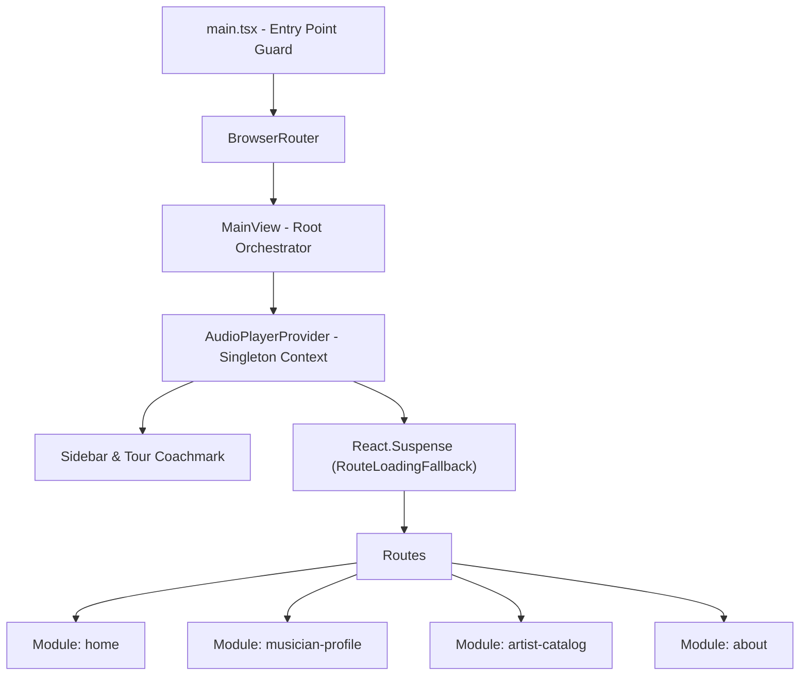

# System Architecture Specification

## 1. Overview & Architectural Paradigm

**Music Gallery Vision — Sound of Malang (Museum Musik Indonesia)** is built using **Clean Architecture** combined with **Feature-Driven Modular Presentation**. The design decouples domain interfaces and data providers from presentation views, organizing visual components into 4 self-contained domain modules under `src/presentation/modules/`.



---

## 2. Feature-Driven Domain Modules (`src/presentation/modules/`)

The application is structured into four domain-driven modules:

### 2.1 `home` (`src/presentation/modules/home/`)
- **Responsibility**: Exhibition landing experience, vinyl hero centerpiece, and legendary musician carousel.
- **Key Components**:
  - `VinylHero.tsx`: Interactive vinyl turntable canvas with spinning disc animation, needle placement state, and audio play/pause synchronization.
  - `ShowcaseSection.tsx`: Horizontal Hall of Legends showcase featuring interactive musician cards with hash navigation (`#showcase-icons`).
- **Shared Dependencies**: Consumes shared `MusicianCard` component.

### 2.2 `musician-profile` (`src/presentation/modules/musician-profile/`)
- **Responsibility**: Individual artist archive detail pages and discography tracklist views.
- **Key Components & Views**:
  - `MusicianDetailView.tsx`: Full editorial artist bio narrative, quote blocks, era metadata, and archival gallery.
  - `MusicianDiscographyView.tsx`: Comprehensive track list display.
  - `BioContent.tsx`: Sub-component rendering structured artist biography, influences, and historical context.
  - `TracklistTable.tsx`: Interactive tracklist with a **3-second auto-collapse timer** on idle or track completion, preventing layout clutter.
  - `ArchivalLightboxModal.tsx`: High-resolution gallery viewer for historical photos with smooth backdrop blur.

### 2.3 `artist-catalog` (`src/presentation/modules/artist-catalog/`)
- **Responsibility**: Searchable, filterable exhibition roster containing extended musician archives (`/extended-archive`).
- **Key Components & Hooks**:
  - `ExtendedArtistsView.tsx`: Catalog orchestrator page integrating multi-parameter filters.
  - `useMusicianFilter.ts`: Custom hook managing multi-faceted filter logic (genre category, alphabetical prefix, text query, and era sorting).
  - `FilterDeckPopover.tsx`: Pop-over filter control deck with category pills and sort toggles.
  - `CatalogGrid.tsx`: Responsive responsive grid layout displaying filtered artist cards.

### 2.4 `about` (`src/presentation/modules/about/`)
- **Responsibility**: Curatorial statement, educational context, and Museum Musik Indonesia (MMI) history.
- **Key Components**:
  - `AboutView.tsx`: Minimalist Swiss editorial page detailing the mission of MMI in preserving East Java musical heritage.

---

## 3. Routing & Code-Splitting Strategy

### 3.1 Route Tree Mapping

| Route Path | View Component | Module | Chunk Split |
| :--- | :--- | :--- | :--- |
| `/` | `HomeView` | `home` | Dynamic Chunk (`React.lazy`) |
| `/musician/:slug` | `MusicianDetailView` | `musician-profile` | Dynamic Chunk (`React.lazy`) |
| `/musician/:slug/discography` | `MusicianDiscographyView` | `musician-profile` | Dynamic Chunk (`React.lazy`) |
| `/extended-archive` | `ExtendedArtistsView` | `artist-catalog` | Dynamic Chunk (`React.lazy`) |
| `/about` | `AboutView` | `about` | Dynamic Chunk (`React.lazy`) |

### 3.2 Dynamic Route Code-Splitting via `React.lazy`

To keep initial bundle payload sizes minimal (`< 200 kB`), view components are loaded lazily in [`MainView.tsx`](file:///d:/Workspace/Music_Gallery_Vision/src/presentation/views/MainView.tsx):

```tsx
const HomeView = React.lazy(() =>
  import("@/presentation/modules/home").then((m) => ({ default: m.HomeView }))
);
const MusicianDetailView = React.lazy(() =>
  import("@/presentation/modules/musician-profile").then((m) => ({ default: m.MusicianDetailView }))
);
const ExtendedArtistsView = React.lazy(() =>
  import("@/presentation/modules/artist-catalog").then((m) => ({ default: m.ExtendedArtistsView }))
);
```

### 3.3 Seamless Fallback Boundary (`RouteLoadingFallback`)

The dynamic routes are wrapped in `<React.Suspense fallback={<RouteLoadingFallback />}>`. The fallback component is styled to match the `#F6F4EE` warm canvas background with a crimson accent spinner (`#FF1F00`), preventing white layout flashes during dynamic asset fetching.

---

## 4. Global Singletons & Lifecycle Safety

### 4.1 Audio Engine Singleton (`AudioPlayerContext`)

The persistent YouTube audio engine sits at the top level of the application shell in `MainView.tsx`, outside the `<React.Suspense>` route boundaries:

```tsx
<AudioPlayerProvider>
  <main className={styles.mainWrapper}>
    {/* Persistent Shell Controls: Sidebar, Coachmark, Audio Engine */}
    <React.Suspense fallback={<RouteLoadingFallback />}>
      <Routes>...</Routes>
    </React.Suspense>
  </main>
</AudioPlayerProvider>
```

- **Audio Continuity**: Navigation between routes (`/` -> `/musician/ian-antono` -> `/about`) does **not** unmount the YouTube `iframe`, guaranteeing uninterrupted playback.
- **Dual-Mode Morphing**: The player morphs seamlessly between **Vinyl Hero Mode** (embedded in the home hero section) and **Floating Pill Mode** (sticky bottom bar active across sub-pages).

### 4.2 DOM Mounting Lifecycle Guard (`main.tsx`)

To prevent race conditions during rapid reloads or Hot Module Replacement (HMR), [`main.tsx`](file:///d:/Workspace/Music_Gallery_Vision/src/presentation/main.tsx) inspects `document.readyState` and enforces a single-mount dataset guard:

```tsx
const mountApp = () => {
  const rootElement = document.getElementById("app");
  if (rootElement && !rootElement.dataset.mounted) {
    rootElement.dataset.mounted = "true";
    createRoot(rootElement).render(
      <React.StrictMode>
        <BrowserRouter>
          <MainView />
        </BrowserRouter>
      </React.StrictMode>
    );
  }
};

if (document.readyState === "loading") {
  document.addEventListener("DOMContentLoaded", mountApp);
} else {
  mountApp();
}
```

### 4.3 Navigation Handoff & Scroll Restoration

- Detail views check `locationState?.from` to return users back to their exact origin (`/#showcase-icons` anchor or `/extended-archive` scroll offset).
- Lucide SVG icons are safely re-initialized on route transitions via `safeInitializeIcons()`.
