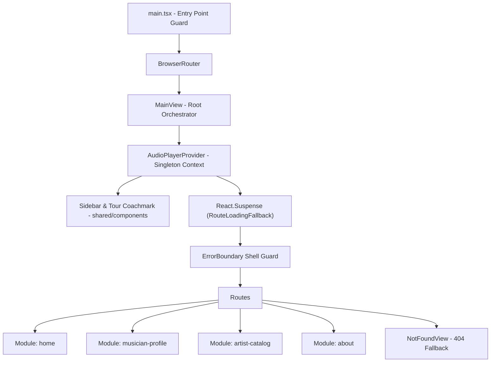

# System Architecture Specification

## 1. Overview & Architectural Paradigm

**Music Gallery Vision — Sound of Malang (Museum Musik Indonesia)** is built using **Clean Architecture** combined with **Feature-Driven Modular Presentation**. The design decouples domain interfaces and data providers from presentation views, organizing visual components into 4 self-contained domain modules under `src/presentation/modules/` and shared UI controls under `src/presentation/shared/components/`.



---

## 2. Domain & Presentation Layer Structure

```
src/
├── domain/                             # Core Business Domain & Entity Schemas
│   └── models/                         # Domain Entity Definitions
│       ├── Musician.ts                 # MusicianData, DiscographyTrack, HistoryEvent interfaces
│       ├── typography.model.ts          # Typography system contracts
│       └── index.ts                    # Domain models barrel re-export
├── infrastructure/                     # External Services & Service Locators
│   └── services/                       # FontService & IconService
├── presentation/
│   ├── context/                        # Persistent AudioPlayerContext Singleton Engine
│   ├── data/                           # Exhibition mock registries (musiciansRegistry.ts)
│   ├── hooks/                          # Shared presentation hooks (useDocumentTitle)
│   ├── modules/                        # Feature-Driven Domain Modules
│   │   ├── home/                       # VinylHero & ShowcaseSection
│   │   ├── musician-profile/           # BioContent, TracklistTable, ArchivalLightboxModal
│   │   ├── artist-catalog/             # CatalogGrid, FilterDeckPopover, useMusicianFilter
│   │   └── about/                      # MMI Curatorial Statement
│   ├── shared/                         # Unified Cross-Module Shared UI
│   │   └── components/                 # ErrorBoundary, Header, Sidebar, InfoModal, MusicianCard, etc.
│   ├── styles/                         # Theme tokens & global Tailwind CSS
│   ├── utils/                          # DOM utilities, stylesheet engine, resolveAssetPath
│   └── views/                          # MainView orchestrator & NotFoundView 404
```

---

## 3. Feature-Driven Domain Modules (`src/presentation/modules/`)

### 3.1 `home` (`src/presentation/modules/home/`)
- **Responsibility**: Exhibition landing experience, vinyl hero centerpiece, and legendary musician carousel.
- **Key Components**:
  - `VinylHero.tsx`: Interactive vinyl turntable canvas with spinning disc animation, needle placement state, and audio play/pause synchronization.
  - `ShowcaseSection.tsx`: Horizontal Hall of Legends showcase featuring interactive musician cards with hash navigation (`#showcase-icons`).

### 3.2 `musician-profile` (`src/presentation/modules/musician-profile/`)
- **Responsibility**: Individual artist archive detail pages and discography tracklist views.
- **Key Components & Views**:
  - `MusicianDetailView.tsx`: Full editorial artist bio narrative, quote blocks, era metadata, and archival gallery with `<NotFoundView />` fallback for missing slugs.
  - `MusicianDiscographyView.tsx`: Comprehensive track list display.
  - `BioContent.tsx`: Sub-component rendering structured artist biography, influences, and historical context.
  - `TracklistTable.tsx`: Interactive tracklist with a **3-second auto-collapse timer** on idle or track completion.
  - `ArchivalLightboxModal.tsx`: High-resolution gallery viewer for historical photos with smooth backdrop blur.

### 3.3 `artist-catalog` (`src/presentation/modules/artist-catalog/`)
- **Responsibility**: Searchable, filterable exhibition roster containing extended musician archives (`/extended-archive`).
- **Key Components & Hooks**:
  - `ExtendedArtistsView.tsx`: Catalog orchestrator page integrating multi-parameter filters.
  - `useMusicianFilter.ts`: Custom hook managing multi-faceted filter logic (genre category, alphabetical prefix, text query, and era sorting).
  - `FilterDeckPopover.tsx`: Pop-over filter control deck with category pills and sort toggles.
  - `CatalogGrid.tsx`: Responsive grid layout displaying filtered artist cards.

### 3.4 `about` (`src/presentation/modules/about/`)
- **Responsibility**: Curatorial statement, educational context, and Museum Musik Indonesia (MMI) history.

---

## 4. Routing, Code-Splitting & Resiliency

### 4.1 Route Tree Mapping & Resiliency Guards

| Route Path | View Component | Module / Location | Resiliency & Fallback |
| :--- | :--- | :--- | :--- |
| `/` | `HomeView` | `home` | Dynamic Chunk + `ErrorBoundary` |
| `/musician/:slug` | `MusicianDetailView` | `musician-profile` | Dynamic Chunk + `ErrorBoundary` + `NotFoundView` |
| `/musician/:slug/discography` | `MusicianDiscographyView` | `musician-profile` | Dynamic Chunk + `ErrorBoundary` |
| `/extended-archive` | `ExtendedArtistsView` | `artist-catalog` | Dynamic Chunk + `ErrorBoundary` |
| `/about` | `AboutView` | `about` | Dynamic Chunk + `ErrorBoundary` |
| `*` | `NotFoundView` | `presentation/views` | Dynamic Chunk + Wildcard 404 |

### 4.2 Code-Splitting & Fallback Boundary

Dynamic view components are loaded lazily in [`MainView.tsx`](file:///d:/Workspace/Music_Gallery_Vision/src/presentation/views/MainView.tsx) and wrapped inside `<React.Suspense fallback={<RouteLoadingFallback />}>` and `<ErrorBoundary>`:

```tsx
<React.Suspense fallback={<RouteLoadingFallback />}>
  <ErrorBoundary>
    <Routes>
      <Route path="/" element={<HomeView ... />} />
      <Route path="/musician/:slug" element={<MusicianDetailView />} />
      <Route path="/musician/:slug/discography" element={<MusicianDiscographyView />} />
      <Route path="/extended-archive" element={<ExtendedArtistsView />} />
      <Route path="/about" element={<AboutView />} />
      <Route path="*" element={<NotFoundView />} />
    </Routes>
  </ErrorBoundary>
</React.Suspense>
```

---

## 5. Global Singletons & Lifecycle Safety

### 5.1 Audio Engine Singleton (`AudioPlayerContext`)

The persistent YouTube audio engine sits at the top level of the application shell in `MainView.tsx`, outside the `<React.Suspense>` route boundaries:
- **Audio Continuity**: Navigation between routes (`/` -> `/musician/ian-antono` -> `/about`) does **not** unmount the YouTube `iframe`.
- **Auto-Stop Decoupling**: Auto-stop playback effects depend strictly on route section changes (`isMusicianSection`), avoiding mutable dependency loop risks.
- **Playback Controls**: Features full floating pill controls (Play/Pause, Discography jump, Stop playback).

### 5.2 Dynamic SEO & Tab Title Management (`useDocumentTitle`)

Page titles are reactively updated on route transitions using the [`useDocumentTitle`](file:///d:/Workspace/Music_Gallery_Vision/src/presentation/hooks/useDocumentTitle.ts) hook:
- Home: `"Beranda Gallery - Sound of Malang | Museum Musik Indonesia"`
- Artist Detail: `"${musician.name} - Eksibisi Digital | Museum Musik Indonesia"`
- Catalog: `"Katalog Arsip Musisi - Sound of Malang | Museum Musik Indonesia"`
- 404: `"Halaman Tidak Ditemukan (404) | Museum Musik Indonesia"`

### 5.3 DOM Mounting Lifecycle Guard (`main.tsx`)

Enforces single-mount execution using `document.readyState` check and `rootElement.dataset.mounted = "true"` guard in [`main.tsx`](file:///d:/Workspace/Music_Gallery_Vision/src/presentation/main.tsx).
