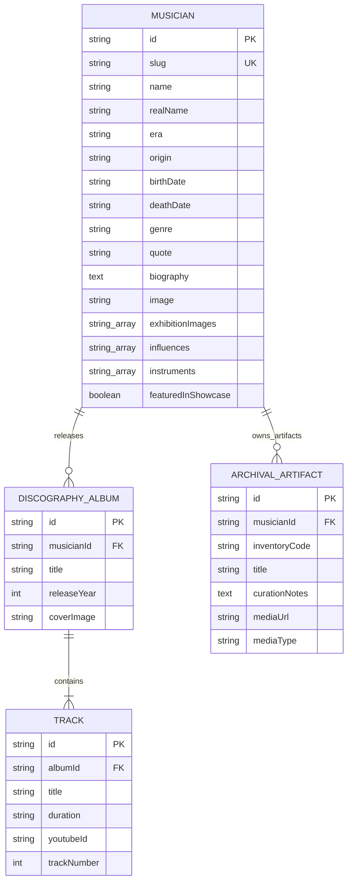

# Backend Data Model & API Specifications

## 1. Overview & Data Layer Architecture

Currently, **Music Gallery Vision** utilizes client-side static JSON data registries located in `src/presentation/data/musiciansRegistry.ts` (and exported through domain abstractions). 

This document defines the schema definitions for the current static stores and specifies the future **RESTful / GraphQL backend data model** for migrating the application to a Headless CMS or dynamic database backend (e.g., PostgreSQL / Strapi / Supabase).

---

## 2. Core Entities & Schemas

### 2.1 Entity Relationship Diagram



---

## 3. Data Models & JSON Schemas

### 3.1 `MusicianData` Schema
```typescript
interface MusicianData {
  id: string;
  slug: string;
  name: string;
  realName?: string;
  year: string; // Era display (e.g., "1970S - PRESENT")
  origin?: string; // Origin city/region (e.g., "Malang, Jawa Timur")
  birthDate?: string;
  deathDate?: string | null;
  genre: string; // Category badge (e.g., "ROCK ORIGINATOR", "LADY ROCKER")
  quote?: string;
  biography: string;
  image: string; // Primary avatar image path in /assets/
  exhibitionImages: string[]; // Archival photo gallery paths
  influences?: string[]; // Array of musical influences
  instruments?: string[]; // Array of played instruments
  discography: DiscographyTrack[];
  featuredInShowcase?: boolean;
}
```

### 3.2 `DiscographyTrack` Schema
```typescript
interface DiscographyTrack {
  id: string;
  title: string;
  album: string;
  year: number;
  duration: string;
  youtubeId: string; // YouTube video ID for persistent audio engine
}
```

---

## 4. RESTful API Contract (Future Backend Specification)

Base URL: `https://api.museummusikindonesia.or.id/v1`

### 4.1 `GET /api/v1/musicians`
Returns a paginated, filterable list of musicians for the exhibition catalog.

- **Query Parameters**:
  - `search` (string, optional): Search query matching `name`, `realName`, `biography`, or `genre`.
  - `genre` (string, optional): Genre filter (e.g., `ROCK`, `POP`, `FOLK`, `KRONCONG`, `LADY ROCKER`).
  - `alphabet` (string, optional): Filter by starting letter of stage name.
  - `sort` (enum, default `newest`): `newest`, `oldest`, `a-z`, `z-a`.
  - `page` (int, default `1`): Page index.
  - `limit` (int, default `20`): Page size.

- **Response Body (`200 OK`)**:
```json
{
  "status": "success",
  "meta": {
    "totalCount": 10,
    "page": 1,
    "limit": 20,
    "totalPages": 1
  },
  "data": [
    {
      "id": "mus-ian-antono",
      "slug": "ian-antono",
      "name": "Ian Antono",
      "realName": "Jusuf Antono Djojo",
      "year": "1970S - PRESENT",
      "genre": "ROCK ORIGINATOR",
      "image": "/assets/ian_antono/Picture2.jpg",
      "featuredInShowcase": true
    }
  ]
}
```

### 4.2 `GET /api/v1/musicians/:slug`
Fetches complete details, biography, influences, and archival gallery for a specific musician.

- **Response Body (`200 OK`)**:
```json
{
  "status": "success",
  "data": {
    "id": "mus-ian-antono",
    "slug": "ian-antono",
    "name": "Ian Antono",
    "realName": "Jusuf Antono Djojo",
    "year": "1970S - PRESENT",
    "origin": "Malang, Jawa Timur",
    "birthDate": "29 Oktober 1950",
    "genre": "ROCK ORIGINATOR",
    "quote": "Musik rock bukan sekadar distorsi, melainkan jiwa dan kejujuran dalam berkarya.",
    "biography": "Ian Antono lahir di Malang pada 29 Oktober 1950...",
    "image": "/assets/ian_antono/Picture2.jpg",
    "exhibitionImages": [
      "/assets/ian_antono/Picture1.jpg",
      "/assets/ian_antono/Picture3.jpg"
    ],
    "influences": ["Deep Purple", "Led Zeppelin", "Jimi Hendrix"],
    "instruments": ["Gitar Elektrik", "Gitar Akustik", "Komposer"]
  }
}
```

### 4.3 `GET /api/v1/musicians/:slug/discography`
Fetches complete discography tracks including YouTube video IDs for playback.

- **Response Body (`200 OK`)**:
```json
{
  "status": "success",
  "musicianSlug": "ian-antono",
  "totalTracks": 3,
  "data": [
    {
      "id": "tr-rumah-kita",
      "title": "Rumah Kita",
      "album": "Semut Hitam",
      "year": 1988,
      "duration": "4:45",
      "youtubeId": "g4QnZfR7j_Y"
    }
  ]
}
```

### 4.4 HTTP Status Codes
- `200 OK`: Request succeeded.
- `400 Bad Request`: Invalid query parameters or body syntax.
- `404 Not Found`: Musician slug or track ID does not exist.
- `500 Internal Server Error`: Unexpected server processing error.
