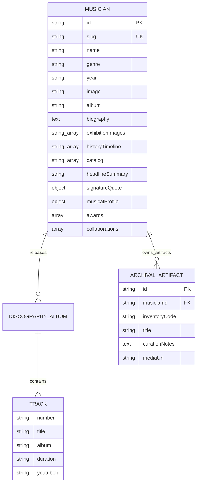

# Backend Data Model & API Specifications

## 1. Overview & Data Layer Architecture

Currently, **Music Gallery Vision** utilizes client-side static JSON data registries defined in `src/domain/models/Musician.ts` and exported through `src/presentation/data/musiciansRegistry.ts`.

This document defines the schema definitions for core domain models and specifies the future **RESTful / GraphQL backend data model** for migrating the application to a Headless CMS or dynamic database backend (e.g., PostgreSQL / Strapi / Supabase).

---

## 2. Core Entities & Schemas (`src/domain/models/Musician.ts`)

### 2.1 Entity Relationship Diagram



---

## 3. Data Models & TypeScript Schemas

### 3.1 `MusicianData` Interface
Source location: [`src/domain/models/Musician.ts`](file:///d:/Workspace/Music_Gallery_Vision/src/domain/models/Musician.ts)

```typescript
export type MilestoneCategory =
  | "release"
  | "award"
  | "concert"
  | "career"
  | "legacy";

export interface HistoryEvent {
  year: string;
  event: string;
  category?: MilestoneCategory;
}

export interface TrackCatalogItem {
  number: string;
  title: string;
  album: string;
  duration: string;
  youtubeId?: string;
}

export interface MusicianQuote {
  text: string;
  source?: string;
  year?: string;
}

export interface AwardItem {
  year: string;
  title: string;
  organization: string;
  category?: string;
}

export interface MusicalProfile {
  primaryInstruments: string[];
  influences?: string[];
  subGenres?: string[];
}

export interface CollaborationItem {
  name: string;
  projectTitle?: string;
  role?: string;
}

export interface MusicianData {
  id: string;
  slug: string;
  name: string;
  genre: string;
  year: string;
  image: string;
  album: string;
  biography: string;
  exhibitionImages?: string[];
  youtubeId?: string;
  historyTimeline: HistoryEvent[];
  catalog: TrackCatalogItem[];

  // Optional Enrichment Fields
  headlineSummary?: string;
  signatureQuote?: MusicianQuote;
  musicalProfile?: MusicalProfile;
  awards?: AwardItem[];
  collaborations?: (string | CollaborationItem)[];
}
```

---

## 4. Media Resolution & Fallback Contract

All asset string URLs are resolved via the centralized utility [`resolveAssetPath`](file:///d:/Workspace/Music_Gallery_Vision/src/presentation/utils/dom.ts).

```typescript
export const DEFAULT_FALLBACK_IMAGE = "/assets/vinyl_record.jpg";

export const resolveAssetPath = (path?: string): string => {
  if (!path || path.trim() === "") return DEFAULT_FALLBACK_IMAGE;
  if (
    path.startsWith("http://") ||
    path.startsWith("https://") ||
    path.startsWith("/")
  ) {
    return path;
  }
  return `/${path}`;
};
```
*Client Contract Guarantee*: If an image path is missing, empty, or unresolvable, the application automatically falls back to `DEFAULT_FALLBACK_IMAGE` (`/assets/vinyl_record.jpg`).

---

## 5. RESTful API Contract (Future Backend Specification)

Base URL: `https://api.museummusikindonesia.or.id/v1`

### 5.1 `GET /api/v1/musicians`
Returns a paginated, filterable list of musicians for the exhibition catalog.

- **Query Parameters**:
  - `search` (string, optional): Search query matching `name`, `biography`, or `genre`.
  - `genre` (string, optional): Genre filter (`ROCK`, `POP`, `FOLK`, `KRONCONG`, `LADY ROCKER`).
  - `alphabet` (string, optional): Filter by starting letter of stage name.
  - `sort` (enum, default `newest`): `newest`, `oldest`, `a-z`, `z-a`.
  - `page` (int, default `1`): Page index.
  - `limit` (int, default `20`): Page size.

- **Response Body (`200 OK`)**:
```json
{
  "status": "success",
  "meta": {
    "totalCount": 10,
    "page": 1,
    "limit": 20,
    "totalPages": 1
  },
  "data": [
    {
      "id": "ian-antono",
      "slug": "ian-antono",
      "name": "IAN ANTONO",
      "genre": "ROCK ORIGINATOR & GUITAR VIRTUOSO",
      "year": "1965 - PRESENT",
      "image": "/assets/ian_antono/Picture2.jpg"
    }
  ]
}
```

### 5.2 `GET /api/v1/musicians/:slug`
Fetches complete details, biography, influences, and archival gallery for a specific musician.

- **Response Body (`200 OK`)**:
```json
{
  "status": "success",
  "data": {
    "id": "ian-antono",
    "slug": "ian-antono",
    "name": "IAN ANTONO",
    "genre": "ROCK ORIGINATOR & GUITAR VIRTUOSO",
    "year": "1965 - PRESENT",
    "image": "/assets/ian_antono/Picture2.jpg",
    "album": "Semut Hitam (1988)",
    "biography": "Ian Antono lahir di Malang pada 29 Oktober 1950...",
    "exhibitionImages": [
      "/assets/ian_antono/Picture1.jpg",
      "/assets/ian_antono/Picture3.jpg"
    ],
    "historyTimeline": [
      {
        "year": "1950",
        "event": "Lahir di Malang, Jawa Timur.",
        "category": "career"
      }
    ],
    "catalog": [
      {
        "number": "01",
        "title": "Rumah Kita",
        "album": "Semut Hitam",
        "duration": "4:45",
        "youtubeId": "g4QnZfR7j_Y"
      }
    ]
  }
}
```

### 5.3 HTTP Status Codes
- `200 OK`: Request succeeded.
- `400 Bad Request`: Invalid query parameters.
- `404 Not Found`: Musician slug does not exist (triggers `<NotFoundView />`).
- `500 Internal Server Error`: Unexpected server error.
