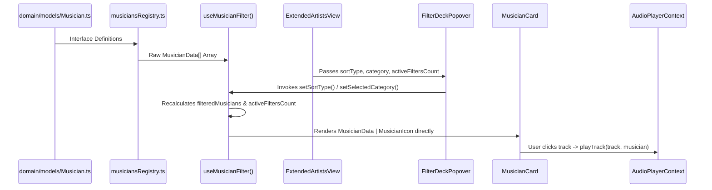

# Data Models & State Stores Specification

## 1. Overview & Data Flow Architecture

This document presents the frontend state contracts, TypeScript entity definitions, custom hooks, and reactive data flow patterns used throughout **Music Gallery Vision**.



---

## 2. Core Domain Entities (`src/domain/models/Musician.ts`)

All entity definitions are declared in [`src/domain/models/Musician.ts`](file:///d:/Workspace/Music_Gallery_Vision/src/domain/models/Musician.ts) and re-exported through the barrel [`src/domain/models/index.ts`](file:///d:/Workspace/Music_Gallery_Vision/src/domain/models/index.ts):

```typescript
import { MusicianData, TrackCatalogItem } from "@/domain/models";
```

### 2.1 Musician Card Component Prop Contract
Location: [`src/presentation/shared/components/MusicianCard.tsx`](file:///d:/Workspace/Music_Gallery_Vision/src/presentation/shared/components/MusicianCard.tsx)

```typescript
export interface MusicianIcon {
  id?: string;
  name: string;
  image: string;
  genre: string;
  album: string;
  year: string;
}

export interface MusicianCardProps {
  musician: MusicianData | MusicianIcon;
  index: number;
  onClick: () => void;
  styles?: MusicianCardStyles;
}
```
*Unified Interface*: `MusicianCard` accepts `MusicianData` directly without requiring intermediate mapper functions.

---

## 3. Custom Hooks & State Contracts

### 3.1 Catalog Filter Hook (`useMusicianFilter`)
Location: [`src/presentation/modules/artist-catalog/hooks/useMusicianFilter.ts`](file:///d:/Workspace/Music_Gallery_Vision/src/presentation/modules/artist-catalog/hooks/useMusicianFilter.ts)

- **Return Contract Interface**:
```typescript
export type SortType = "oldest" | "newest" | "a-z" | "z-a";

export interface UseMusicianFilterReturn {
  sortType: SortType;
  setSortType: React.Dispatch<React.SetStateAction<SortType>>;
  selectedCategory: string;
  setSelectedCategory: React.Dispatch<React.SetStateAction<string>>;
  selectedAlphabet: string;
  setSelectedAlphabet: React.Dispatch<React.SetStateAction<string>>;
  searchQuery: string;
  setSearchQuery: React.Dispatch<React.SetStateAction<string>>;
  filteredMusicians: MusicianData[];
  activeFiltersCount: number;
  handleResetFilters: () => void;
}
```

- **Filter Counter & Reset Rules**:
  ```typescript
  const activeFiltersCount = useMemo(() => {
    let count = 0;
    if (sortType !== "newest") count++;
    if (selectedCategory !== "ALL") count++;
    if (selectedAlphabet !== "ALL") count++;
    if (searchQuery.trim() !== "") count++;
    return count;
  }, [sortType, selectedCategory, selectedAlphabet, searchQuery]);

  const handleResetFilters = (): void => {
    setSortType("newest");
    setSelectedCategory("ALL");
    setSelectedAlphabet("ALL");
    setSearchQuery("");
  };
  ```

---

### 3.2 Document Title SEO Hook (`useDocumentTitle`)
Location: [`src/presentation/hooks/useDocumentTitle.ts`](file:///d:/Workspace/Music_Gallery_Vision/src/presentation/hooks/useDocumentTitle.ts)

```typescript
export const useDocumentTitle = (title: string, baseSuffix = "Museum Musik Indonesia") => {
  useEffect(() => {
    const fullTitle = title ? `${title} | ${baseSuffix}` : baseSuffix;
    document.title = fullTitle;
  }, [title, baseSuffix]);
};
```

---

### 3.3 Audio Player Context (`AudioPlayerContext`)
Location: [`src/presentation/context/AudioPlayerContext.tsx`](file:///d:/Workspace/Music_Gallery_Vision/src/presentation/context/AudioPlayerContext.tsx)

- **State & Method Signature**:
```typescript
export interface ActiveTrackData extends TrackCatalogItem {
  artistName: string;
  artistSlug: string;
  artistImage?: string;
}

export interface AudioPlayerContextType {
  activeTrack: ActiveTrackData | null;
  isPlaying: boolean;
  isMinimized: boolean;
  playTrack: (
    track: TrackCatalogItem,
    artistName: string,
    artistSlug: string,
    artistImage?: string,
  ) => void;
  pauseTrack: () => void;
  resumeTrack: () => void;
  togglePlay: () => void;
  stopTrack: () => void;
  setIsMinimized: (minimized: boolean) => void;
}
```

- **Decoupled Auto-Stop Effect**:
```typescript
useEffect(() => {
  if (!isMusicianSection) {
    stopTrack();
  }
}, [isMusicianSection]);
```
- **Restored Floating Pill Controls**: Features interactive Play/Pause, Discography jump, and Stop playback buttons.
