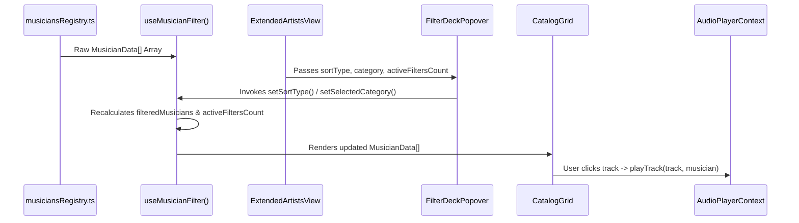

# Data Models & State Stores Specification

## 1. Overview & Data Flow Architecture

This document presents the frontend state contracts, TypeScript type definitions, custom hooks, and reactive data flow patterns used throughout the **Music Gallery Vision** application.



---

## 2. Core Domain Types & Interfaces

### 2.1 Musician Entity (`MusicianData`)
Defined in `src/presentation/data/musiciansRegistry.ts` (and mirrored in domain abstractions):

```typescript
export interface DiscographyTrack {
  id: string;
  title: string;
  album: string;
  year: number;
  duration: string;
  youtubeId: string;
}

export interface MusicianData {
  id: string;
  slug: string;
  name: string;
  realName?: string;
  year: string;
  origin?: string;
  birthDate?: string;
  deathDate?: string | null;
  genre: string;
  quote?: string;
  biography: string;
  image: string;
  exhibitionImages: string[];
  influences?: string[];
  instruments?: string[];
  discography: DiscographyTrack[];
  featuredInShowcase?: boolean;
}
```

---

## 3. Custom Hooks & State Contracts

### 3.1 Catalog Filter Hook (`useMusicianFilter`)
Location: `src/presentation/modules/artist-catalog/hooks/useMusicianFilter.ts`

- **Return Contract Interface**:
```typescript
export type SortType = "oldest" | "newest" | "a-z" | "z-a";

export interface UseMusicianFilterReturn {
  sortType: SortType;
  setSortType: React.Dispatch<React.SetStateAction<SortType>>;
  selectedCategory: string;
  setSelectedCategory: React.Dispatch<React.SetStateAction<string>>;
  selectedAlphabet: string;
  setSelectedAlphabet: React.Dispatch<React.SetStateAction<string>>;
  searchQuery: string;
  setSearchQuery: React.Dispatch<React.SetStateAction<string>>;
  filteredMusicians: MusicianData[];
  activeFiltersCount: number;
  handleResetFilters: () => void;
}
```

- **Filter Logic & Predicate Rules**:
  - **Search Query**: Multi-field text matching across stage name, real name, biography narrative, and genre string.
  - **Category Filter**: Case-insensitive substring match against `genre`.
  - **Alphabetical Filter**: Case-insensitive initial character match against stage `name`.
  - **Active Filter Counter**: Evaluates active overrides from defaults:
    ```typescript
    const activeFiltersCount = useMemo(() => {
      let count = 0;
      if (sortType !== "newest") count++;
      if (selectedCategory !== "ALL") count++;
      if (selectedAlphabet !== "ALL") count++;
      if (searchQuery.trim() !== "") count++;
      return count;
    }, [sortType, selectedCategory, selectedAlphabet, searchQuery]);
    ```
  - **Reset Handler**: Resets all state values to defaults (`sortType: "newest"`, `selectedCategory: "ALL"`, `selectedAlphabet: "ALL"`, `searchQuery: ""`).

---

### 3.2 Audio Engine Context (`AudioPlayerContext`)
Location: `src/presentation/context/AudioPlayerContext.tsx`

- **State & Method Signature**:
```typescript
export interface AudioTrack {
  id: string;
  title: string;
  artist: string;
  album: string;
  year: number;
  youtubeId: string;
  coverImage: string;
}

export interface AudioPlayerContextType {
  currentTrack: AudioTrack | null;
  isPlaying: boolean;
  isMuted: boolean;
  currentTime: number;
  duration: number;
  playTrack: (track: AudioTrack) => void;
  pauseTrack: () => void;
  resumeTrack: () => void;
  togglePlay: () => void;
  toggleMute: () => void;
  seekTo: (seconds: number) => void;
  mode: "hero" | "pill"; // Controls dual-mode UI presentation
  setMode: (mode: "hero" | "pill") => void;
}
```

- **Playback Lifecycle**:
  1. `playTrack(track)` initializes YouTube IFrame API instance if unmounted.
  2. Subscribes to YouTube player state changes (`PLAYING`, `PAUSED`, `ENDED`).
  3. Updates progress timers every 500ms via `setInterval`.
  4. Automatically transitions to Floating Pill mode when the user scrolls away from the home hero or navigates to sub-pages.
