# 🧩 COMPREHENSIVE DEPENDENCY & INTERACTION AUDIT FOR SAFE MODULAR REFACTORING

**Project**: Sound of Malang — Music Gallery Vision 2026  
**Module**: Domain-Driven Feature Module Refactoring Audit  
**Last Updated**: September 5, 2026

---

## 1. DEPENDENCY MATRIX TABLE

| Audited Component / Module                                                                                                    | Consumed Hooks & Contexts                                                       | Emitted Events / Actions                                                                    | Target Navigation Routes & Hash Links                                                                                                                                                             | Shared UI & Style Dependencies                                                                |
| :---------------------------------------------------------------------------------------------------------------------------- | :------------------------------------------------------------------------------ | :------------------------------------------------------------------------------------------ | :------------------------------------------------------------------------------------------------------------------------------------------------------------------------------------------------ | :-------------------------------------------------------------------------------------------- |
| [`MainView.tsx`](file:///d:/Workspace/Music_Gallery_Vision/src/presentation/views/MainView.tsx)                               | `useNavigate()`, `useLocation()`, `AudioPlayerProvider`                         | Global `"show-toast"` listener, window `resize` listener                                    | `/`, `/musician/:slug`, `/musician/:slug/discography`, `/extended-archive`, `/about`                                                                                                              | `Sidebar`, `OnboardingCoachmark`, `MobileFallbackScreen`, `ErrorBoundary`                     |
| [`AudioPlayerContext.tsx`](file:///d:/Workspace/Music_Gallery_Vision/src/presentation/context/AudioPlayerContext.tsx)         | `useLocation()`, `useNavigate()`, `createContext()`                             | State updates (`activeTrack`, `isPlaying`, `isMinimized`)                                   | Path regex: `/^\/musician\/[^/]+\/discography\/?$/` and `/^\/musician\/[^/]+\/?$/`                                                                                                                | Persistent YouTube `iframe` DOM element (`#persistent-youtube-player`), Floating Audio Bar UI |
| [`HomeView.tsx`](file:///d:/Workspace/Music_Gallery_Vision/src/presentation/views/HomeView.tsx)                               | `useNavigate()`, `useLayoutEffect()`, `useRef()`, `FontService`                 | `onToggleSidebar()`, `onHeroVisibilityChange()`, `window.history.replaceState()`            | Navigates to `/musician/:slug` (`state: { musician, from: "home" }`), `/extended-archive` (`state: { showInfoModal: true }`), Hash spy: `#showcase-icons`, `#timeline-section`, `#footer-section` | `Header`, `OverlayNavbar`, `MusicianCard`, `musiciansRegistry`                                |
| [`MusicianDetailView.tsx`](file:///d:/Workspace/Music_Gallery_Vision/src/presentation/views/MusicianDetailView.tsx)           | `useParams()`, `useNavigate()`, `useLocation()`, `FontService`                  | Image lightbox trigger (`setSelectedLightboxImage`), collaboration badge hover              | Navigates to `/musician/:slug/discography`, `/extended-archive`, `/#showcase-icons`                                                                                                               | `Header` (with `MUSICIAN_NAV_ITEMS`), Lightbox overlay, `musiciansRegistry`                   |
| [`MusicianDiscographyView.tsx`](file:///d:/Workspace/Music_Gallery_Vision/src/presentation/views/MusicianDiscographyView.tsx) | `useParams()`, `useNavigate()`, `useLocation()`, `useAudioPlayer()`, `useRef()` | `playTrack()`, 3-second auto-collapse timer (`autoCollapseTimerRef`), track expand/minimize | Navigates to `/musician/:slug`, `/extended-archive`, `/#showcase-icons`                                                                                                                           | `Header` (with `MUSICIAN_NAV_ITEMS`), YouTube icon CTA, `AudioPlayerContext`                  |
| [`ExtendedArtistsView.tsx`](file:///d:/Workspace/Music_Gallery_Vision/src/presentation/views/ExtendedArtistsView.tsx)         | `useNavigate()`, `useLocation()`, `useMusicianFilter()`, `useRef()`             | `setIsFilterDeckOpen()`, `handleResetFilters()`, popover click-outside listener             | Navigates to `/musician/:slug` (`state: { musician, from: "extended" }`), `/#showcase-icons`                                                                                                      | `MusicianCard`, `InfoModal`, `ErrorBoundary`, `useMusicianFilter` hook                        |
| [`MusicianCard.tsx`](file:///d:/Workspace/Music_Gallery_Vision/src/presentation/components/MusicianCard.tsx)                  | `FontService`                                                                   | `onClick()` callback, keyboard `Enter`/`Space` listener                                     | N/A (invoked by parent container)                                                                                                                                                                 | `resolveAssetPath()`, image fallback handler                                                  |

---

## 2. CURRENT COMPONENT TREE DIAGRAM

```mermaid
graph TD
    AppRoot["document.getElementById('app')"] --> BrowserRouter["BrowserRouter"]
    BrowserRouter --> MainView["MainView Shell"]

    subgraph Global Context & Layout Shell
        MainView --> AudioPlayerProvider["AudioPlayerProvider"]
        AudioPlayerProvider --> PersistentIframe["#persistent-player-wrapper (YouTube Iframe)"]
        AudioPlayerProvider --> CompactAudioBar["Compact Audio Bar (Pill UI)"]
        MainView --> FallbackGuard["MobileFallbackScreen (isMobile && !isBypassed)"]
        MainView --> CoachmarkTour["OnboardingCoachmark (isTourOpen)"]
        MainView --> DesktopSidebar["Sidebar (Desktop)"]
        MainView --> ToastContainer["Toast Alert Container"]
    end

    subgraph Routing View Switcher
        MainView --> Routes["Routes"]
        Routes --> RouteHome["/ -> HomeView"]
        Routes --> RouteDetail["/musician/:slug -> MusicianDetailView"]
        Routes --> RouteDisco["/musician/:slug/discography -> MusicianDiscographyView"]
        Routes --> RouteExtended["/extended-archive -> ExtendedArtistsView (in ErrorBoundary)"]
        Routes --> RouteAbout["/about -> AboutView"]
    end

    subgraph View Dependencies
        RouteHome --> HeaderHome["Header (leftActionType='menu')"]
        RouteHome --> OverlayNav["OverlayNavbar (Floating Bottom Capsule)"]
        RouteHome --> CardGridHome["MusicianCard[] (Hall of Legends)"]

        RouteDetail --> HeaderDetail["Header (customNavItems=['BIOGRAPHY','DISCOGRAPHY'])"]
        RouteDetail --> LightboxModal["Archival Lightbox Modal"]

        RouteDisco --> HeaderDisco["Header (customNavItems=['BIOGRAPHY','DISCOGRAPHY'])"]
        RouteDisco --> TracklistCard["Collapsible Tracklist Card"]

        RouteExtended --> FilterDeck["Pop-over Filter Deck"]
        RouteExtended --> CardGridExtended["MusicianCard[] (Filtered Grid)"]
        RouteExtended --> InfoModalComponent["InfoModal"]
    end
```



---

## 3. FRAGILE COUPLING WARNING LIST

> [!WARNING]
> The following variables, paths, and side-effects must be carefully preserved during modular refactoring to prevent UI regression or broken routes:

1. **Path Alias Resolution (`@/`)**:
   - `tsconfig.json` and `vite.config.js` resolve `@/*` to `./src/*`.
   - Any moved file must update relative imports (`../../infrastructure/...`) or standardized `@/domain/...`, `@/presentation/...` aliases.

2. **`location.state` Navigation Flags**:
   - `HomeView` and `ExtendedArtistsView` pass `state: { musician, from: "home" | "extended" }` when navigating to `/musician/:slug`.
   - `MusicianDetailView` and `MusicianDiscographyView` rely on `locationState?.from` to determine whether the "RETURN TO SHOWCASE" button navigates back to `/extended-archive` or `/#showcase-icons`.

3. **`AudioPlayerContext` Path Regex Detection**:
   - `AudioPlayerContext` uses exact regular expressions to monitor `location.pathname`:
     - Discography page: `/^\/musician\/[^/]+\/discography\/?$/`
     - Detail page: `/^\/musician\/[^/]+\/?$/`
   - Changing route URL structures will break auto-playback stopping and mode morphing.

4. **DOM Element ID Anchors for Scroll & Coachmarks**:
   - The onboarding tour and navigation links rely on explicit DOM element IDs:
     - `#hero-section` (Hero canvas)
     - `#showcase-icons` (Hall of Legends grid)
     - `#timeline-section` (Cultural evolution table)
     - `#footer-section` (Curatorial footer)
     - `#tour-step-1-start-journey`, `#tour-step-2-staff-guideline`, `#tour-step-3-settings`

5. **Discography Auto-Collapse Timer Ref (`autoCollapseTimerRef`)**:
   - `MusicianDiscographyView` uses `useRef<ReturnType<typeof setTimeout> | null>(null)` to auto-collapse the tracklist after 3 seconds. The timer must be cleared on component unmount to prevent memory leaks.

---

## 4. CLEAN REFACTORING BLUEPRINT

The refactoring plan organizes presentation views and specialized components into **4 domain-driven feature modules** under `src/modules/` (or `src/presentation/modules/`):

```
src/
├── presentation/
│   ├── modules/
│   │   ├── home/                       # Module 1: Exhibition Entrance & Showcase
│   │   │   ├── components/             # VinylWrapper, CulturalTimeline, ShowcaseGrid
│   │   │   ├── views/                  # HomeView.tsx
│   │   │   └── index.ts                # Public module API export
│   │   ├── musician-profile/           # Module 2: Musician Biography & Discography
│   │   │   ├── components/             # MusicianHeader, TracklistCard, LightboxModal
│   │   │   ├── views/                  # MusicianDetailView.tsx, MusicianDiscographyView.tsx
│   │   │   └── index.ts                # Public module API export
│   │   ├── artist-catalog/             # Module 3: Full Roster & Search Catalog
│   │   │   ├── components/             # FilterDeckPopover, CatalogGrid
│   │   │   ├── hooks/                  # useMusicianFilter.ts
│   │   │   ├── views/                  # ExtendedArtistsView.tsx
│   │   │   └── index.ts                # Public module API export
│   │   └── about/                      # Module 4: Curatorial Statement & Info
│   │       ├── views/                  # AboutView.tsx
│   │       └── index.ts                # Public module API export
```

### Module Refactoring Migration Map

| Feature Module         | Source Component Files                                    | Target Relocated Path                                                                                                                                     | Export Strategy                                                                                                  |
| :--------------------- | :-------------------------------------------------------- | :-------------------------------------------------------------------------------------------------------------------------------------------------------- | :--------------------------------------------------------------------------------------------------------------- |
| **`home`**             | `HomeView.tsx`                                            | `src/presentation/modules/home/views/HomeView.tsx`                                                                                                        | Export `HomeView` from `src/presentation/modules/home/index.ts`                                                  |
| **`musician-profile`** | `MusicianDetailView.tsx`<br>`MusicianDiscographyView.tsx` | `src/presentation/modules/musician-profile/views/MusicianDetailView.tsx`<br>`src/presentation/modules/musician-profile/views/MusicianDiscographyView.tsx` | Export `MusicianDetailView`, `MusicianDiscographyView` from `src/presentation/modules/musician-profile/index.ts` |
| **`artist-catalog`**   | `ExtendedArtistsView.tsx`<br>`useMusicianFilter.ts`       | `src/presentation/modules/artist-catalog/views/ExtendedArtistsView.tsx`<br>`src/presentation/modules/artist-catalog/hooks/useMusicianFilter.ts`           | Export `ExtendedArtistsView`, `useMusicianFilter` from `src/presentation/modules/artist-catalog/index.ts`        |
| **`about`**            | `AboutView.tsx`                                           | `src/presentation/modules/about/views/AboutView.tsx`                                                                                                      | Export `AboutView` from `src/presentation/modules/about/index.ts`                                                |
