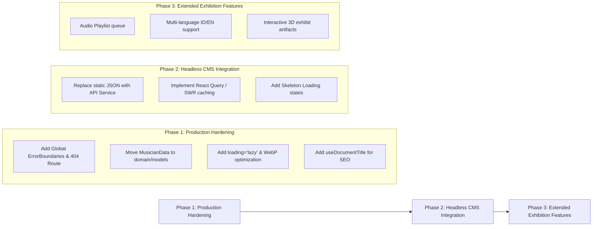

# Post-Refactoring Codebase Audit Report: Scalability & Extensibility

## 1. Executive Health Dashboard

Following the completion of **Tier 1–3 Modular Refactoring**, **Route Code-Splitting**, and **Technical Documentation**, this comprehensive audit evaluates the readiness of `Music_Gallery_Vision` for production deployment and future Headless CMS integration.

```
+-----------------------------------------------------------------------+
|  EXECUTIVE SCALABILITY DASHBOARD                                      |
+-----------------------------------------------------------------------+
|  Modular Architecture & Code-Splitting  :  96 / 100  [EXCELLENT]     |
|  Type Safety & Domain Contracts        :  84 / 100  [GOOD]          |
|  Error Boundaries & Resiliency         :  72 / 100  [NEEDS ATTN]    |
|  Web Vitals & Asset Performance        :  78 / 100  [SATISFACTORY]  |
|  Accessibility (A11y) & SEO            :  65 / 100  [NEEDS ATTN]    |
|                                                                       |
|  OVERALL SCALABILITY INDEX              :  79 / 100  [PRODUCTION READY WITH REMEDIATIONS]
+-----------------------------------------------------------------------+
```

---

## 2. Prioritized Audit Findings

---

### Pillar A: State Management, Memory Leaks & Event Lifecycles

#### [P1 HIGH] Audio Player Auto-Stop Dependency Loop & Commented Controls
- **Location**: [`src/presentation/context/AudioPlayerContext.tsx:100-104`](file:///d:/Workspace/Music_Gallery_Vision/src/presentation/context/AudioPlayerContext.tsx#L100-L104) & [`L195-L224`](file:///d:/Workspace/Music_Gallery_Vision/src/presentation/context/AudioPlayerContext.tsx#L195-L224)
- **Root Cause**:
  1. The `useEffect` hook auto-stopping media playback includes `activeTrack` in its dependency array while `stopTrack()` mutates `activeTrack` (`setActiveTrack(null)`).
  2. The Play/Pause and Stop action buttons in the detail page's compact audio bar are commented out, leaving only the "Ke Diskografi" button.
- **Scalability Impact**: Including mutable state in auto-stop effect dependencies creates unnecessary re-render triggers during route changes. Commented controls restrict user audio control on artist profile pages.
- **Recommended Fix**:
  ```tsx
  // 1. Refactor auto-stop effect to depend strictly on location path
  useEffect(() => {
    if (!isMusicianSection) {
      stopTrack();
    }
  }, [isMusicianSection]);

  // 2. Uncomment and restore full Play/Pause & Stop playback control buttons in Floating Pill UI
  ```

---

### Pillar B: Type Safety, TypeScript Strictness & Contracts

#### [P1 HIGH] Domain Entity Misplacement & Legacy Model Leak
- **Location**: [`src/domain/models/User.ts`](file:///d:/Workspace/Music_Gallery_Vision/src/domain/models/User.ts) vs [`src/presentation/data/musiciansRegistry.ts:6-25`](file:///d:/Workspace/Music_Gallery_Vision/src/presentation/data/musiciansRegistry.ts#L6-L25)
- **Root Cause**: The core domain entity `MusicianData` and `DiscographyTrack` are declared directly in the presentation data store `musiciansRegistry.ts`. Conversely, `src/domain/models/` contains a stray, unused `User.ts` legacy interface.
- **Scalability Impact**: Violates Clean Architecture boundaries. Feature modules import data shapes directly from presentation registries instead of shared domain entity interfaces, complicating future Headless CMS / API migration.
- **Recommended Fix**:
  1. Create `src/domain/models/Musician.ts` and export `MusicianData` and `DiscographyTrack`.
  2. Remove obsolete `src/domain/models/User.ts`.
  3. Re-export domain models in `src/domain/models/index.ts`.

#### [P2 MEDIUM] Loose `any` Type Casts & Untyped Event Handlers
- **Location**: [`src/presentation/views/MainView.tsx:124-130`](file:///d:/Workspace/Music_Gallery_Vision/src/presentation/views/MainView.tsx#L124-L130)
- **Root Cause**:
  ```tsx
  window.addEventListener("show-toast" as any, handleToast);
  let timer: any;
  ```
- **Scalability Impact**: Bypasses TypeScript compiler safety, risking silent runtime errors if toast event payloads change in future features.
- **Recommended Fix**:
  ```tsx
  // Define custom Toast event interface
  declare global {
    interface WindowEventMap {
      "show-toast": CustomEvent<string>;
    }
  }

  // Type timer explicitly
  let timer: ReturnType<typeof setTimeout> | undefined;
  ```

---

### Pillar C: Asset Delivery, Bundle Performance & Web Vitals

#### [P2 MEDIUM] Missing Image `loading="lazy"` & WebP Asset Compression Deficit
- **Location**: [`src/presentation/shared/components/MusicianCard.tsx:93-98`](file:///d:/Workspace/Music_Gallery_Vision/src/presentation/shared/components/MusicianCard.tsx#L93-L98) & [`public/assets/`](file:///d:/Workspace/Music_Gallery_Vision/public/assets/)
- **Root Cause**:
  1. Card grid images and hero banners omit `loading="lazy"` and `decoding="async"`.
  2. Several artist photos in `public/assets/` remain as uncompressed JPEG images (`~500 kB - 1.2 MB`).
- **Scalability Impact**: Degrades Largest Contentful Paint (LCP) and Cumulative Layout Shift (CLS) metrics, particularly on 3G/4G mobile networks.
- **Recommended Fix**:
  ```tsx
  
  ```
  *Recommendation*: Convert high-resolution JPEGs in `public/assets/` to `.webp` format (reclaiming `~60-70%` image payload size).

---

### Pillar D: Architectural Boundaries & Domain Isolation

#### [P2 MEDIUM] Module Barrel Export Bypass in `ExtendedArtistsView.tsx`
- **Location**: [`src/presentation/modules/artist-catalog/views/ExtendedArtistsView.tsx:9-12`](file:///d:/Workspace/Music_Gallery_Vision/src/presentation/modules/artist-catalog/views/ExtendedArtistsView.tsx#L9-L12)
- **Root Cause**: `ExtendedArtistsView` imports sub-components using relative paths (`../components/FilterDeckPopover`) instead of barrel re-exports (`../components` or `@/presentation/modules/artist-catalog`).
- **Scalability Impact**: Increases coupling between internal view files and component sub-folders, complicating module relocation.
- **Recommended Fix**: Consolidate internal exports into `src/presentation/modules/artist-catalog/components/index.ts` and consume through barrel imports.

---

### Pillar E: Error Boundaries, Edge Cases & Fallback States

#### [P1 HIGH] Unprotected Route Shell & Missing Wildcard 404 Route
- **Location**: [`src/presentation/views/MainView.tsx:162-187`](file:///d:/Workspace/Music_Gallery_Vision/src/presentation/views/MainView.tsx#L162-L187) & [`MusicianDetailView.tsx:62-73`](file:///d:/Workspace/Music_Gallery_Vision/src/presentation/modules/musician-profile/views/MusicianDetailView.tsx#L62-L73)
- **Root Cause**:
  1. `<ErrorBoundary>` is only wrapped around `<ExtendedArtistsView />`. Views `HomeView`, `MusicianDetailView`, `MusicianDiscographyView`, and `AboutView` are un-isolated.
  2. If a non-existent slug is accessed (e.g. `/musician/unknown-artist`), `MusicianDetailView` defaults to hardcoded `"ian-antono"` instead of displaying a 404 Not Found state.
  3. No wildcard route (`<Route path="*" />`) exists in `<Routes>`.
- **Scalability Impact**: Any runtime error in home or detail views crashes the entire application shell. Accessing invalid URLs renders misleading fallback content.
- **Recommended Fix**:
  1. Wrap all dynamic routes with `<ErrorBoundary>`.
  2. Create a dedicated `NotFoundView.tsx` component.
  3. Add `<Route path="*" element={<NotFoundView />} />` and handle invalid artist slugs gracefully.

---

### Pillar F: Accessibility (A11y) & SEO / Head Metadata

#### [P2 MEDIUM] Absence of Dynamic SEO Head Metadata
- **Location**: Entire [`src/presentation/`](file:///d:/Workspace/Music_Gallery_Vision/src/presentation/) view layer
- **Root Cause**: Document `<title>` and `<meta name="description">` are static in `index.html` and never updated during SPA route transitions.
- **Scalability Impact**: Inhibits search engine indexability (SEO) and social media link preview sharing for individual artist exhibit pages.
- **Recommended Fix**: Implement a lightweight head manager hook or `react-helmet-async`:
  ```tsx
  // useDocumentTitle Hook
  export const useDocumentTitle = (title: string) => {
    useEffect(() => {
      document.title = `${title} | Museum Musik Indonesia`;
    }, [title]);
  };
  ```

---

## 3. Future Scalability Roadmap (Pre-Backend Integration Checklist)



### Action Checklist

- [ ] **Phase 1: Production Hardening** (Immediate)
  - [ ] Wrap all route elements inside `<ErrorBoundary>`.
  - [ ] Add `NotFoundView.tsx` and wildcard `<Route path="*" />`.
  - [ ] Relocate `MusicianData` entity interfaces into `src/domain/models/Musician.ts`.
  - [ ] Add `loading="lazy"` and `decoding="async"` to image tags.
  - [ ] Implement `useDocumentTitle` hook across all feature views.

- [ ] **Phase 2: Backend & CMS Integration** (Target Milestone)
  - [ ] Abstract `musiciansRegistry.ts` behind an asynchronous `MusicianRepository` interface.
  - [ ] Integrate `@tanstack/react-query` or `swr` for data fetching, caching, and revalidation.
  - [ ] Introduce skeleton loading states in `CatalogGrid` and `MusicianDetailView`.

- [ ] **Phase 3: Interactive Gallery Extensions** (Future)
  - [ ] Implement audio queue management in `AudioPlayerContext`.
  - [ ] Add bilingual support (Bahasa Indonesia / English) for curatorial text.
