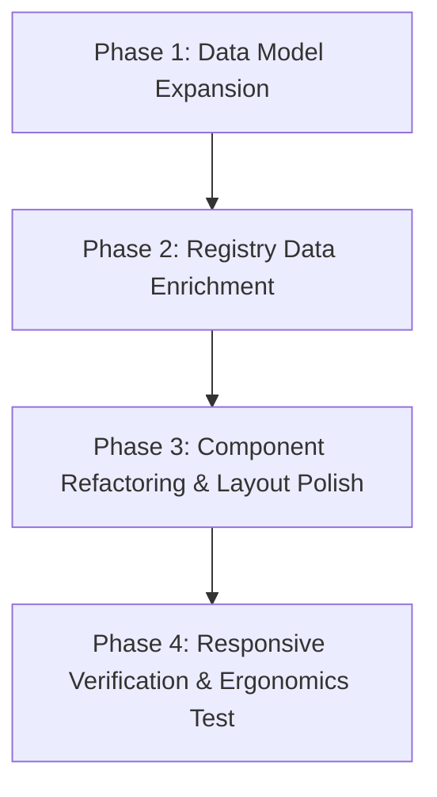

# LAPORAN AUDIT & REKOMENDASI PENGAYAAN KONTEN BIOGRAFI MUSISI
**Target Komponen**: [`MusicianDetailView.tsx`](file:///d:/Workspace/Music_Gallery_Vision/src/presentation/views/MusicianDetailView.tsx)  
**Data Model**: [`musiciansRegistry.ts`](file:///d:/Workspace/Music_Gallery_Vision/src/presentation/data/musiciansRegistry.ts)  
**Status Scan**: *Non-Destructive Audit Complete (Tidak ada perubahan kode pada tahap ini)*

---

## 1. CURRENT BIOGRAPHY UI & DATA REVIEW

### A. Evaluasi Tampilan UI saat ini (`MusicianDetailView.tsx`)
1. **Hero Header & Navigation Alignment**:
   - Komponen menggunakan `<Header>` kustom dengan dua navigasi tab: `BIOGRAPHY` (aktif) dan `DISCOGRAPHY`.
   - Tata letak header konsisten dengan `MusicianDiscographyView.tsx` untuk mencegah *layout shift*.

2. **Struktur Grid Top-Level**:
   - Layout menggunakan *2-Column Asymmetric Grid* (`grid-cols-1 lg:grid-cols-12 gap-12 lg:gap-20`):
     - **Kolom Kiri (`lg:col-span-7`)**: Menampilkan Nama Artis (`h1` raksasa dengan font `Bodoni Moda`/`Poppins`), Paragraf Biografi Singkat, dan *Vertical History Timeline*.
     - **Kolom Kanan (`lg:col-span-5`)**: Menampilkan *Sticky Photo Frame* (`aspect-[3/4]`) dengan filter *grayscale contrast*, efek hover warna, serta badge `#ARCHIVE-{ID}`.

3. **Temuan Kunci (Gap Analysis)**:
   - **Teks Biografi Terlalu Monoton**: Biografi disajikan dalam 1 paragraf narasi datar tanpa hierarki visual (tidak ada *lead paragraph*, *callout box*, atau *pull quote*).
   - **Elemen Data Terabaikan**: Properi `genre` dan `year` sudah ada pada schema `MusicianData` dan bahkan memiliki kelas CSS `styles.heroSection.genreBadge`, namun **belum di-render** pada UI `MusicianDetailView.tsx`.
   - **Aset Gambar Pameran Tidak Digunakan**: Schema `MusicianData` memiliki array `exhibitionImages`, namun komponen detail biografi belum menampilkan galeri foto arsip pameran.
   - **Timeline Masih Konvensional**: `historyTimeline` hanya menampilkan pasangan string `year` dan `event` tanpa kategori (misal: *Release*, *Award*, *Formation*) maupun indikator visual interaktif.

---

## 2. ENRICHMENT FEATURE MATRIX

Tabel berikut merumuskan rekomendasi penambahan seksi biografi interaktif dengan konsep *Editorial Music Gallery*:

| No | Fitur / Elemen | Deskripsi Konten & Fungsionalitas | Nilai UX & Estetika Visual (Editorial Gallery) | Rekomendasi Posisi UI |
|---|---|---|---|---|
| 1 | **Genre & Era Badges + Headline Summary** | Menampilkan badge `GENRE`, `ACTIVE ERA`, serta kalimat *sub-headline* berukuran sedang tepat di bawah Nama Musisi. | Memberikan konteks instan mengenai identitas musisi sebelum pengunjung membaca paragraf panjang. | **Hero Section Left Col** (Tepat di atas / bawah `h1` Nama Musisi) |
| 2 | **Signature Quote / Motto** | *Blockquote* raksasa dengan font serit/script editorial (`Bodoni Moda` / `Pinyon Script`) yang memuat kutipan filosofi musik dari seniman. | Menciptakan *focal point* artistik bergaya majalah musik klasik (seperti Rolling Stone / Billboard). | **Di bawah Paragraf Biografi**, sebelum Historical Timeline |
| 3 | **Musical Style, Instruments & Influences** | Chip/Tag visual interaktif yang merinci instrumen ikonik (misal: *Gibson Les Paul Custom*, *Vocal Range Soprano*), genre spesifik, dan musisi pemberi pengaruh. | Memberikan wawasan teknis & histori musikalitas bagi penikmat musik sejati. | **Seksi Baru 2-Kolom** di bawah Timeline |
| 4 | **Career Milestones & Chronology (Enhanced)** | Pengembangan `historyTimeline` dengan badge kategori (Album, Konser, Penghargaan) dan *highlight dot* berwarna tajam. | Memudahkan scannability sejarah karir tanpa terasa melelahkan untuk dibaca. | **Main Body Section** (Kolom Kiri) |
| 5 | **Notable Achievements & Awards** | Grid kartu mini/badge bertema emas/monokrom untuk piala AMI Awards, rekor penjualan album, atau status *Pioneer*. | Mempertegas legasi dan pengakuan industri atas karya sang musisi. | **Seksi Card Grid** (Di bawah Bio & Quote) |
| 6 | **Press Reviews & Critical Acclaim** | Carousel / Callout box berisi testimoni kritikus musik, media nasional, atau komentar maestro musisi lain. | Menambah validasi sosial & kedalaman narasi sejarah musik (*musicology perspective*). | **Editorial Quote Strip** (Full-width / Card Box) |
| 7 | **Exhibition Archival Photo Gallery** | Galeri foto grid/lightbox interaktif yang memanfaatkan array `exhibitionImages` untuk menampilkan momen panggung jadul / arsip pameran. | Menyajikan aspek visual historis yang kaya untuk mendukung narasi biografi. | **Kolom Kanan** (Di bawah Sticky Photo) atau **Bottom Gallery Section** |

---

## 3. PROPOSED DATA SCHEMA UPDATE

Berikut adalah draf pembaruan TypeScript interface pada [`musiciansRegistry.ts`](file:///d:/Workspace/Music_Gallery_Vision/src/presentation/data/musiciansRegistry.ts) untuk menampung fitur-fitur pengayaan di atas tanpa merusak data lama (*backwards compatible*):

```typescript
// Proposed updates for src/presentation/data/musiciansRegistry.ts

export type MilestoneCategory = "release" | "award" | "concert" | "career" | "legacy";

export interface HistoryEvent {
  year: string;
  event: string;
  category?: MilestoneCategory; // Kategori opsional untuk badge visual
}

export interface MusicianQuote {
  text: string;
  source?: string;
  year?: string;
}

export interface AwardItem {
  year: string;
  title: string;
  organization: string; // Misal: "Anugerah Musik Indonesia (AMI)"
  category?: string;
}

export interface PressReview {
  quote: string;
  reviewerOrMedia: string; // Misal: "Rolling Stone Indonesia"
  year?: string;
}

export interface MusicalProfile {
  primaryInstruments: string[]; // Misal: ["Gibson Les Paul Custom", "Marshall JCM800"]
  influences?: string[];        // Misal: ["Deep Purple", "Led Zeppelin"]
  subGenres?: string[];         // Misal: ["Hard Rock", "Heavy Metal", "Symphonic Rock"]
}

export interface MusicianData {
  id: string;
  slug: string;
  name: string;
  genre: string;
  year: string; // Era aktif (misal: "1970s - PRESENT")
  image: string;
  album: string;
  biography: string;
  
  // Existing Optional
  exhibitionImages?: string[];
  youtubeId?: string;
  historyTimeline: HistoryEvent[];
  catalog: TrackCatalogItem[];

  // NEW PROPOSED ENRICHMENT FIELDS (All Optional for Safety)
  headlineSummary?: string;       // Ringkasan 1-kalimat filosofi / julukan
  signatureQuote?: MusicianQuote;  // Kutipan ikonik musisi
  musicalProfile?: MusicalProfile; // Instrumen, pengaruh, & instrumen utama
  awards?: AwardItem[];           // Daftar penghargaan penting
  pressReviews?: PressReview[];   // Kutipan kritikus media
  collaborations?: string[];       // Kolaborator legendaris (misal: ["God Bless", "Gong 2000", "Iwan Fals"])
}
```

---

## 4. RECOMMENDED ACTION PLAN (Langkah Implementasi Safe & Progressive)



### Langkah 1: Update Data Interface Schema (`musiciansRegistry.ts`)
- Tambahkan properti opsional (`signatureQuote`, `musicalProfile`, `awards`, `headlineSummary`) pada `MusicianData`.
- Karena seluruh field baru bernilai opsional (`?`), tidak ada potensi error pada komponen lain yang mengonsumsi `MusicianData`.

### Langkah 2: Enrichment Data Dummy/Real Musisi Utamanya (`musiciansRegistry.ts`)
- Isi data pengayaan awal untuk musisi utama (contoh: *Ian Antono*, *Sylvia Saartje*, *Sal Priadi*).

### Langkah 3: Re-structure Komponen Visual (`MusicianDetailView.tsx`)
1. **Hero Header**: Aktifkan rendering badge `genre` dan `year` di atas Nama Musisi.
2. **Quote Block**: Sisipkan seksi *Editorial Blockquote* berdesain typography megah tepat di bawah narasi biografi.
3. **Instruments & Influences**: Buat sub-komponen chip/card bersih untuk instrumen dan pengaruh musikal.
4. **Awards & Milestones**: Tampilkan grid badge penghargaan yang ringkas.
5. **Archival Gallery**: Tambahkan seksi *Exhibition Photo Grid* jika `exhibitionImages` tersedia.

### Langkah 4: Verifikasi Reading Ergonomics & Visual Polish
- Pastikan hirarki font (`Bodoni Moda` untuk headline/quote, `Outfit`/`Poppins` untuk body, font `mono` untuk data statistik) menghasilkan kontras dan *readability* yang nyaman di perangkat mobile maupun desktop.
